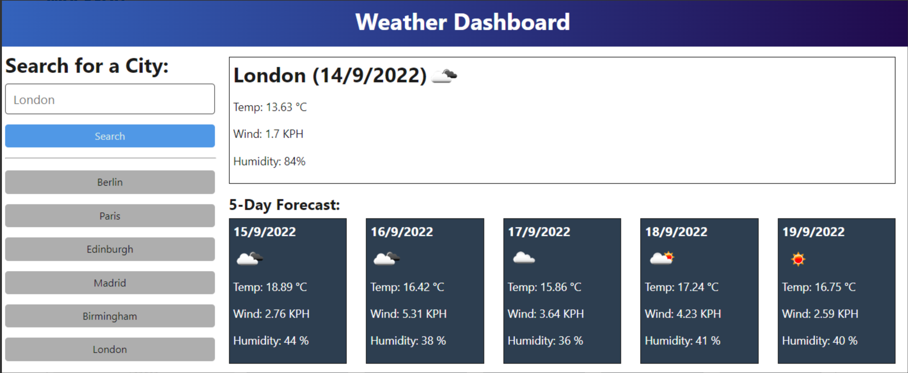

# 5 Day Weather Dashboard
Webapp that allows users to see the weather forecast for cities of their choosing powered by the OpenWeatherMap API.

## Description
A simple webapp that allows the user to search for a city and see a forecast for the current day and the upcoming days. The app will save previous searches as to allow the user to return to forecast when needed between visits.

### My User Story:
```
AS A traveler
I WANT to see the weather outlook for multiple cities
SO THAT I can plan a trip accordingly
```

### Features:
- Dynamically generated page.
- Displays current forecast as a card at top of page and displays individual cards for upcoming days in the 5 day forecast.
- Saves content to localstorage for persistance.

### Mock up:

### Preview of webpage:


## Installation
N/A

## Usage
Deployed webpage can be found here:  [c4rli's 5 Day Weather Dashboard](https://c4rli.github.io/5-Day-Weather-Dashboard/)

## Credits
Source code written by carli n. aka c4rli ++

## License
Please refer to the LICENSE in the repo.
